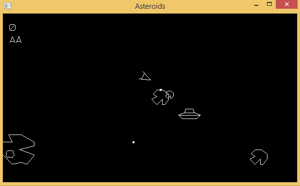

Asteroids in C++ for Windows and Android
========================================

A simple cross-platform implementation of the classic Asteroids game written in C++. Graphics is done with OpenGL. No external libraries are used (except [gl3w](https://github.com/skaslev/gl3w) for OpenGL loading). The repository contains a Visual Studio 2013 project for building the Windows version and an Eclipse project for the Android version.

You can download built EXE and APK on the ["Releases" page](https://github.com/newagebegins/asteroids/releases) or using the following links:

[Download EXE (Windows)](https://github.com/newagebegins/asteroids/releases/download/v1.0/Asteroids.exe)  
[Download APK (Android)](
https://github.com/newagebegins/asteroids/releases/download/v1.0/Asteroids.apk)

## Controls

On Windows:  
Left arrow - turn left  
Right arrow - turn right  
Up arrow - move forward  
Spacebar - shoot

Android version uses on-screen buttons.

## Gameplay GIF

